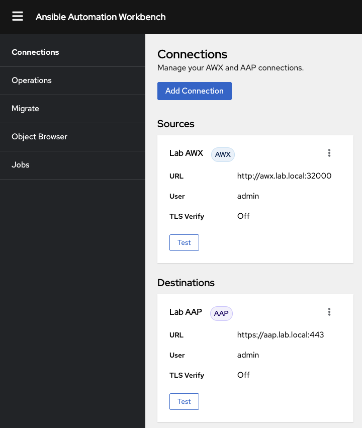
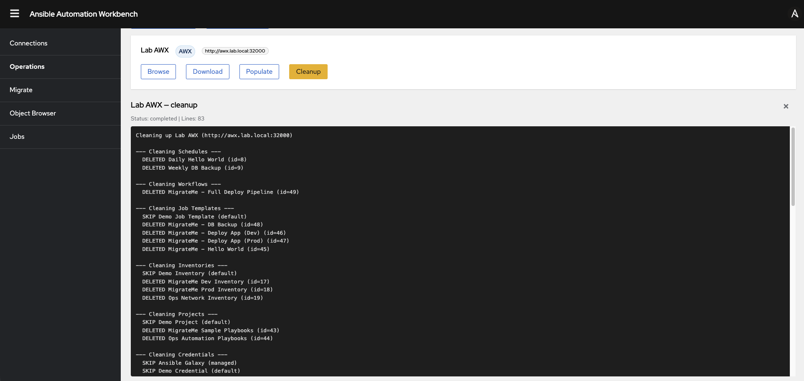
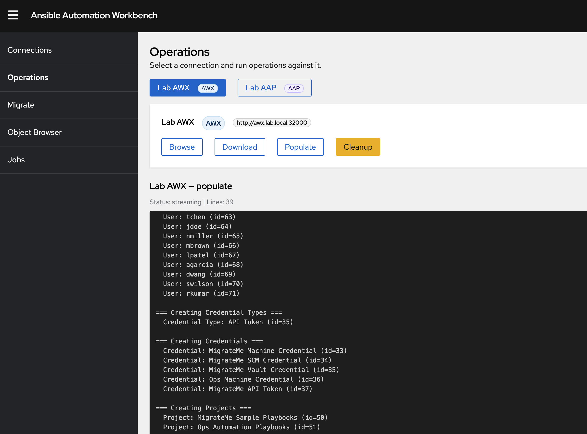
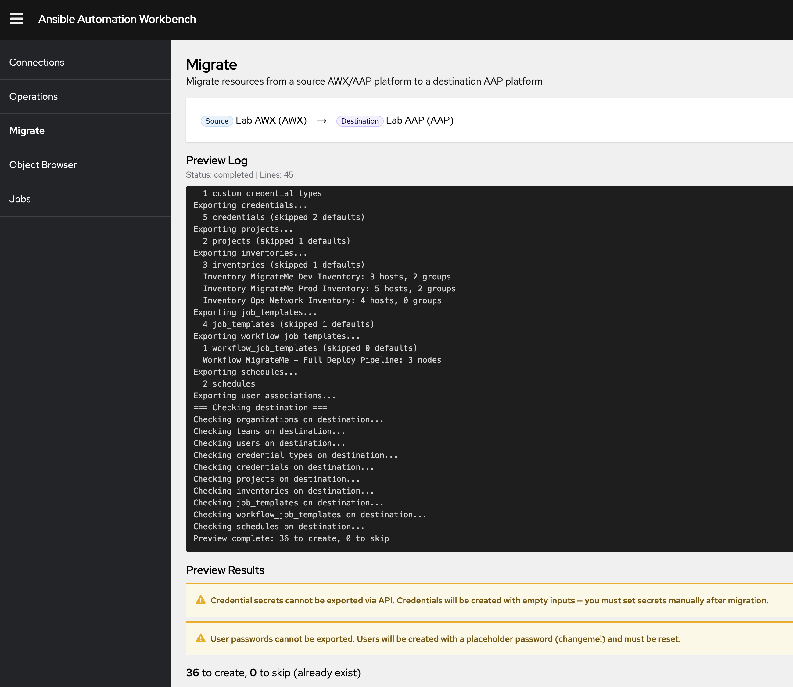
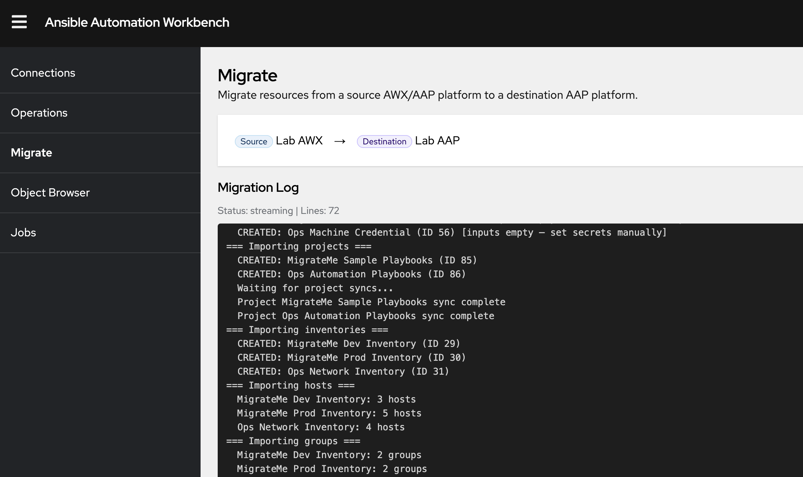

# Ansible Automation Workbench

A web tool for managing AWX and AAP 2.x environments.  
Browse resources, populate sample data, export assets and migrate between automation platforms, from a single interface.  
Additionally it can be useful as a support tool for Ansible workshops, demos or just for better understanding the APIs.  

## Screenshots

| Connections | Operations | Object Browser |
|:-----------:|:----------:|:--------------:|
|  |  |  |

| Populate | Preview Migration | Migration |
|:--------:|:-----------------:|:---------:|
|  |  |  |

## Features

- **Object Browser** — Browse any API resource type (organizations, credentials, job templates, schedules, ee's etc.) across connected AWX and AAP instances
- **Migrate** — API-driven migration from AWX/AAP to AAP: preview with conflict detection, without Ansible cli dependency
- **Populate** — On an empty platform, create sample objects for testing and demos
- **Export** — Download API assets in dependency order as JSON files
- **Cleanup** — Clean up an automation platform, except for default and required control plane objects

## What this tool isn't for

- Handling of RBAC model differences from older AWX versions
- Provide self-service (non-admin) capabilities
- Replace Configuration as Code workflows (e.g. `infra.aap_configuration`, GitOps) for production environments
- Production-grade backup and restore — exports are JSON snapshots for convenience, not a DR solution

## Download

Pre-built binaries for Linux, macOS and Windows are available at [Releases](https://github.com/rflorenc/ansible-automation-workbench/releases).  

## Usage

### Binaries
#### Linux (x86)

```bash
RELEASE=0.4.0
ARTIFACT=https://github.com/rflorenc/ansible-automation-workbench/releases/latest/download/ansible-automation-workbench_${RELEASE}_linux_amd64.tar.gz

mkdir -p /tmp/workbench && cd /tmp/workbench
curl -sLO $ARTIFACT
tar xzf ansible-automation-workbench_*.tar.gz

cp config.yaml.example config.yaml   # edit with your connections
./autoworkbench --config config.yaml
```

#### MacOS (arm64)

```bash
RELEASE=0.4.0
ARTIFACT=https://github.com/rflorenc/ansible-automation-workbench/releases/download/v${RELEASE}/ansible-automation-workbench_${RELEASE}_darwin_arm64.tar.gz

mkdir -p /tmp/workbench && cd /tmp/workbench
curl -sLO $ARTIFACT
tar xzf ansible-automation-workbench_*.tar.gz

cp config.yaml.example config.yaml   # edit with your connections
./autoworkbench --config config.yaml
```

### Container images / K8s / OpenShift

Container images are published to [quay.io/rlourencc/ansible-automation-workbench](https://quay.io/repository/rlourencc/ansible-automation-workbench) on every release.

#### Docker / Podman

```bash
# Create a config.yaml with your connections (see Configuration section below)
cp config.yaml.example config.yaml

# Run
docker run --rm -p 8080:8080 -v ./config.yaml:/config/config.yaml:ro \
  quay.io/rlourencc/ansible-automation-workbench:0.3.0
```

#### Docker Compose

```bash
cp config.yaml.example config.yaml   # edit with your connections
docker-compose up
```

#### Kubernetes / OpenShift

```bash
# Edit the ConfigMap with your connections
kubectl edit -k deploy/k8s/configmap.yaml

# Deploy
kubectl apply -k deploy/k8s/

# OpenShift: expose the service
oc expose svc/autoworkbench
```


## Local build

```bash
# compiles frontend + backend into a go executable
make build

# Run
./autoworkbench --config config.yaml
```

Open `http://localhost:8080` in your browser.

## Configuration

Create a `config.yaml` file, or use the provided as a base:

```yaml
listen: ":8080"

connections:
  - name: My AWX
    type: awx
    role: source
    scheme: http
    host: awx.example.com
    port: 80
    username: admin
    password: secret
    insecure: false

  - name: My AAP
    type: aap
    role: destination
    scheme: https
    host: aap.example.com
    port: 443
    username: admin
    password: secret
    insecure: true
```

Connections can also be created at runtime through the UI.

## Development

```bash
# Terminal 1 — frontend (Vite dev server with hot reload)
cd web && npm run dev

# Terminal 2 — backend (proxies frontend from Vite)
go run ./cmd/workbench/ --dev --config config.yaml
```

## Build Requirements

- Go 1.23+
- Node.js 20+
